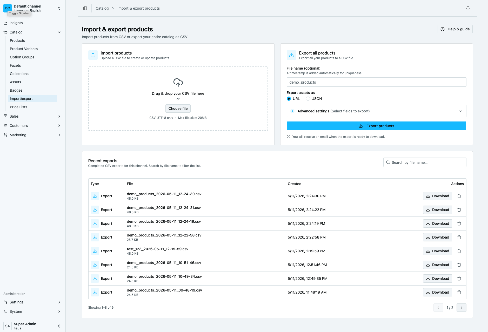
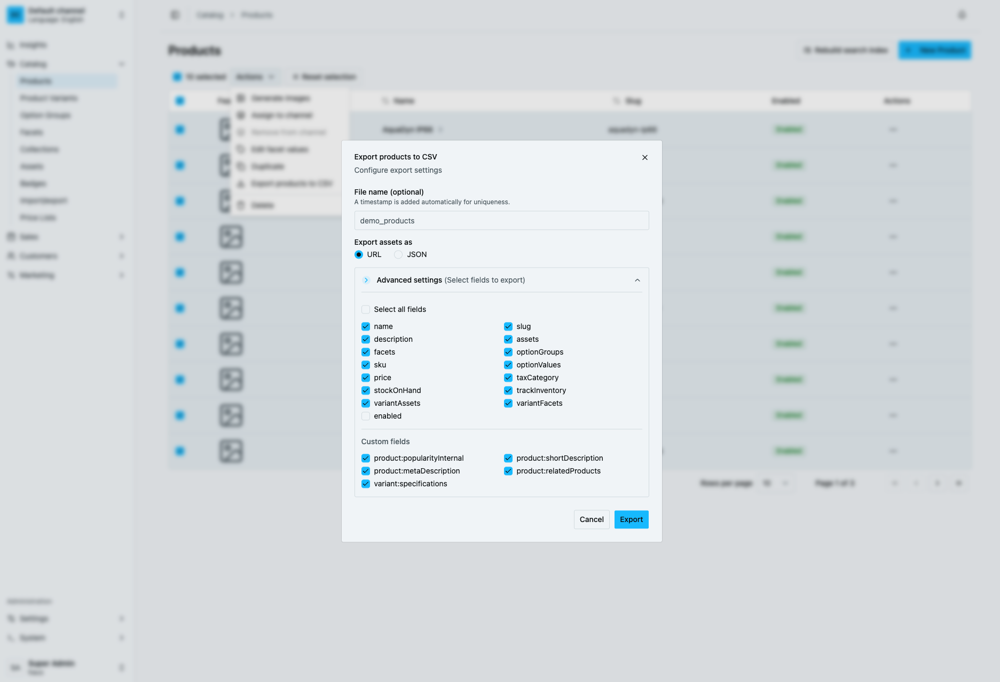

# Product Import Export Plugin

A Vendure plugin for importing and exporting product data via CSV. Supports bulk product management and data migration between environments.

## Features

* **Import** – Bulk upload products from CSV with validation, custom fields, assets, facets, and variants
* **Export** – Export products to CSV with selected fields; export all products or a selection
* **Storage strategies** – Store exported files in S3 or locally on disk (with automatic fallback)
* **UI** – Admin UI and Dashboard integration for import and export



## Compatibility

Vendure **^2.0.0** or **^3.0.0**

## Getting started

```bash npm2yarn
npm install @haus-tech/product-import-export-plugin
```

## Configuration

Add the plugin to your Vendure configuration.

```typescript
export const config = {
  plugins: [
    ProductImportExportPlugin.init({
      importOptions: {}, // Configure import options
      exportOptions: {
        storageStrategy: 's3', // 's3' | 'disk'
        s3Options: {
          bucket: 'your-bucket',
          region: 'your-region',
          credentials: {
            accessKeyId: '...',
            secretAccessKey: '...',
          },
        },
      },
    }),
  ],
}
```

## Configuration Options

### Import options

| Option                   | Type                                            | Default    | Description                                                                                                                  |
| ------------------------ | ----------------------------------------------- | ---------- | ---------------------------------------------------------------------------------------------------------------------------- |
| `updateProductSlug`      | `boolean`                                       | `true`     | Update product slug from the `name` field in the CSV                                                                         |
| `restoreSoftDeleted`     | `boolean`                                       | `true`     | Restore soft-deleted products/variants found by id or SKU during import. If `false`, new products will be created instead. |
| `storageStrategy`        | `ImportJobStorageStrategy`                      | local disk | Strategy instance for queued import file storage and retrieval.                                                              |
| `storageStrategyFactory` | `(injector: Injector) => ImportJobStorageStrategy` | `undefined` | Factory for DI-aware strategy creation (recommended for S3/remote storage).                                                  |
| `importJobStorage`       | `'local' \| 's3'`                              | `'local'`  | Deprecated compatibility flag. Prefer `storageStrategy` / `storageStrategyFactory`.                                          |

Available import storage strategies:

- `LocalImportJobStorageStrategy` (default)
- `S3ImportJobStorageStrategy`

### Export options

| Option                  | Type                  | Default                 | Description                                                  |
| ----------------------- | --------------------- | ----------------------- | ------------------------------------------------------------ |
| `defaultFileName`       | `string`              | `'products_export.csv'` | Default filename for exports                                 |
| `exportAssetsAsOptions` | `('url' \| 'json')[]` | `['url', 'json']`       | Available formats for asset export                           |
| `defaultExportAssetsAs` | `'url' \| 'json'`     | `'url'`                 | Default asset export format                                  |
| `defaultExportFields`   | `string[]`            | See above               | Fields that will be pre-selected in the export UI            |
| `requiredExportFields`  | `string[]`            | `['name', 'sku']`       | Fields that must always be included                          |
| `storageStrategy`       | `'s3' \| 'disk'`      | `'disk'`                | Where exported files are stored                              |
| `s3Options`             | `object`              | `undefined`             | S3 configuration (required when `storageStrategy` is `'s3'`) |

### Storage strategy

The plugin supports configurable storage for exported files:

* **S3** – Stores export files in an S3-compatible bucket
* **Disk (default)** – Saves files locally on the server

## CSV Format for Import

### Required columns

- `name` – Product name (use `name:en`, `name:sv` etc. for multiple languages)
- `sku` – Variant SKU (unique per variant)

### Optional columns

| Column                        | Format                                                       | Example                                                                                    |
| ----------------------------- | ------------------------------------------------------------ | ------------------------------------------------------------------------------------------ |
| `name`, `slug`, `description` | Text, or `name:en`, `name:sv` for translations               | `My Product`                                                                               |
| `assets`                      | Pipe-separated URLs, or JSON `[{"url":"...","name":"..."}]`  | `https://example.com/1.jpg\|https://example.com/2.jpg`                                     |
| `facets`                      | `facet:value` pairs, pipe-separated                          | `Brand:Acme\|Category:Electronics`                                                         |
| `optionGroups`                | Pipe-separated group names                                   | `Size\|Color`                                                                              |
| `optionValues`                | Pipe-separated values (order matches option groups)          | `Large\|Blue`                                                                              |
| `price`                       | Number (in smallest currency unit)                           | `9999`                                                                                     |
| `taxCategory`                 | Tax category name                                            | `standard`                                                                                 |
| `stockOnHand`                 | Number                                                       | `100`                                                                                      |
| `trackInventory`              | `true` or `false`                                            | `true`                                                                                     |
| `variantAssets`               | Same format as `assets`                                      | `https://example.com/variant.jpg`                                                          |
| `variantFacets`               | Same format as `facets`                                      | `Material:Cotton`                                                                          |
| `enabled`                     | `true` or `false`                                            | `true`                                                                                     |
| Custom fields                 | Column name = custom field name; value depends on field type | Add columns for any Product or ProductVariant custom fields defined in your Vendure config |

#### Import behavior rules

- If a column is omitted from the CSV header, that field is left unchanged on existing products/variants.
- If a column exists in the header but the cell is empty, that field is explicitly cleared.
- For products with more than one variant, `optionGroups` and `optionValues` are required.

#### Multi-language support

Use language-specific columns by suffixing the field name with the language code. The language codes must match those configured in your Vendure instance (e.g. `en`, `sv`).

| Column pattern           | Example columns        | Use case                                         |
| ------------------------ | ---------------------- | ------------------------------------------------ |
| `name:en`, `name:sv`     | Product name per lang  | Translated product names                         |
| `slug:en`, `slug:sv`     | Slug per lang          | Translated URLs                                  |
| `description:en`         | Description per lang   | Translated descriptions                          |
| `facets:en`, `facets:sv` | Facets per lang        | Translated facet names and values                |
| `optionGroups:en`        | Option groups per lang | Translated option group names (e.g. Size, Color) |
| `optionValues:en`        | Option values per lang | Translated option values (e.g. Large, Blue)      |

Example CSV with English and Swedish:

```csv
name:en,name:sv,sku,facets:en,facets:sv
"Red Shirt","Röd tröja",SHIRT-001,"Color:Red|Size:Large","Färg:Röd|Storlek:Stor"
```

#### Multiple values (pipe separator)

Fields that can have multiple values use the pipe character `|` as a separator:

- **Facets**: `Brand:Acme|Category:Electronics`
- **Option groups**: `Size|Color`
- **Option values**: `Large|Blue` (order matches option groups)
- **Assets**: `https://example.com/1.jpg|https://example.com/2.jpg`

## Usage

:::note
The Admin UI offers basic import and export. Some features such as the export-all option and the list of exported files are only available in the Dashboard. New features will be added to the Dashboard only.
:::

### Importing products

1. Create a CSV with the columns above.
2. Go to the Admin UI or Dashboard and open the Product Import section.
3. Upload the CSV and choose options (update slugs, restore soft-deleted, main language).
4. Select the update strategy: **merge** (keep existing facets/assets) or **replace** (overwrite).
5. Start the import.

### Exporting products

1. In the Admin UI or Dashboard, select products to export (or use bulk export).
2. Configure export fields (assets, facets, custom fields, etc.).
   - For products with more than one variant, `optionGroups` and `optionValues` must be included.
   - `productId` is not available as a selectable export field.
   - If `customFields` are not selected, no custom-field columns are written to the CSV.
3. Choose asset format: URL or JSON.
4. Start the export (it is added to a job queue and runs in the background).
5. Download the CSV when the export is complete. Your downloaded files will be listed in the export view.



## Optional: Email notification on export complete

If you use `@vendure/email-plugin`, you can add an email notification when an export finishes from the `/email` subpath.

The plugin now provides a default fallback template for `product-export-complete/body.hbs`.  
If you define your own template in your app's template directory, your template takes precedence.
Note: templates for `@vendure/email-plugin` should be valid MJML.

```typescript
import path from 'path'
import { DefaultEmailPlugin, FileBasedTemplateLoader, defaultEmailHandlers } from '@vendure/email-plugin'
import {
  withProductExportedHandler,
  withProductExportedTemplateFallback,
} from '@haus-tech/product-import-export-plugin/email'

export const config = {
  plugins: [
    DefaultEmailPlugin.init({
      handlers: withProductExportedHandler(defaultEmailHandlers),
      templateLoader: withProductExportedTemplateFallback(
        new FileBasedTemplateLoader(path.join(__dirname, '../static/email/templates')),
      ),
    }),
  ],
}
```

## Resources

- [Vendure Plugin Documentation](https://docs.vendure.io/guides/developer-guide/plugins/)
- [Vendure Import/Export Guide](https://docs.vendure.io/guides/developer-guide/importing-data/)
